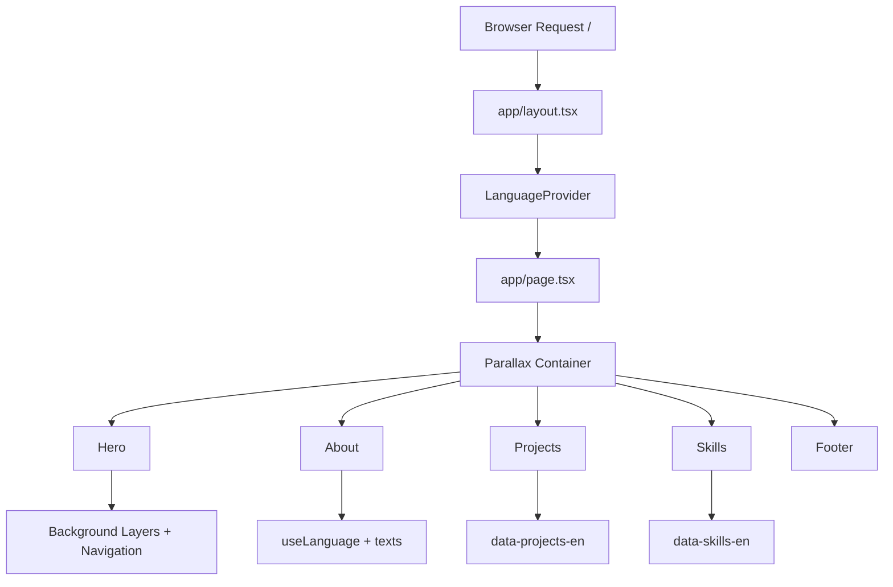

# Portfolio (Next.js + Parallax)

Interactive single-page portfolio built with Next.js, React, and `@react-spring/parallax`.

## Run locally

```bash
npm install
npm run dev
```

## Workspace order (read this first -> next)

1. `package.json`  
   Scripts and dependencies.
2. `next.config.ts`  
   Next.js build/export behavior.
3. `app/layout.tsx`  
   Global providers and global CSS entry.
4. `app/page.tsx`  
   Main parallax container and section orchestration.
5. Section files in `app/`  
   `Hero.tsx` -> `About.tsx` -> `Projects.tsx` -> `Skills.tsx` -> `Footer.tsx`.
6. Reusable UI in `app/components/`  
   Building blocks used by sections.
7. Data in `lang/`  
   English-only text, projects, and skills datasets.
8. Styling in `app/style/` and `tailwind.config.ts`  
   Component-specific CSS and theme tokens.

## System flowchart



## Notes

- French datasets and language toggling were removed to keep runtime simpler.
- Unused theme switch/context code and unused reference assets were removed.
- Detailed flow docs: `docs/SYSTEM_FLOW.md`.
