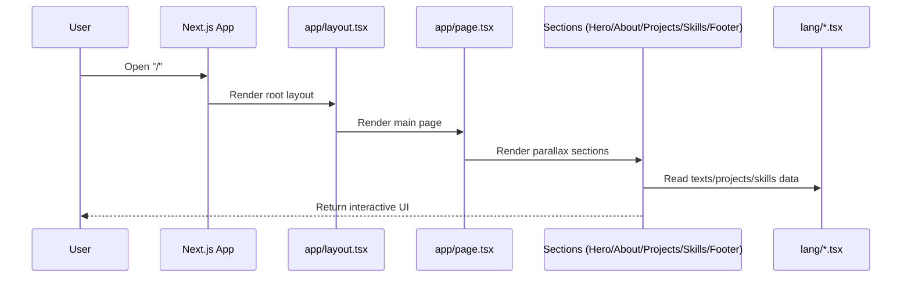

# System Flow and Code Order

## Runtime flow

1. `app/layout.tsx` initializes global styles and providers.
2. `app/page.tsx` mounts a 4-page parallax container.
3. Section rendering order:
   - `app/Hero.tsx`
   - `app/About.tsx`
   - `app/Projects.tsx`
   - `app/Skills.tsx`
   - `app/Footer.tsx`
4. Sections consume shared components from `app/components/`.
5. Text/content comes from English datasets in `lang/`.

## Build flow

1. `next.config.ts` controls static export and image optimization mode.
2. Next.js compiles `app/` routes/components.
3. Tailwind + CSS files from `app/style/` are bundled.
4. Output is exported to static files (`output: "export"`).

## Sequence diagram

